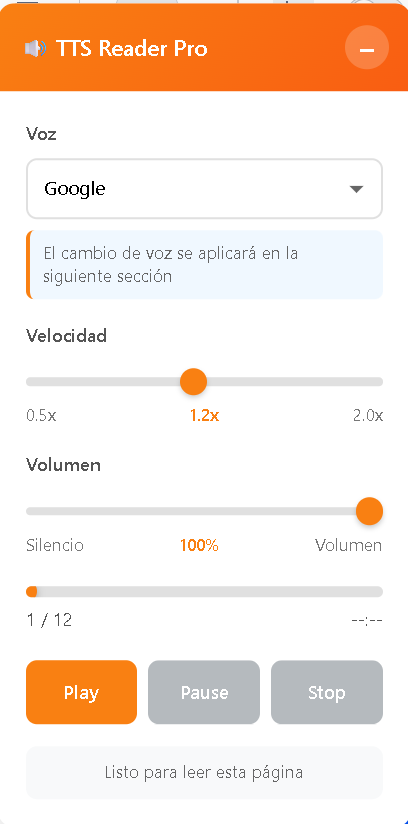
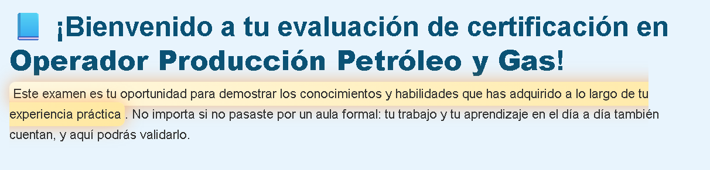

# Lector de Voz TTS Pro – El lector de texto a voz más avanzado para Moodle

**¡El único plugin TTS con resaltado sincronizado, barra de progreso clicable y scroll automático perfecto!**

Plugin de bloque para Moodle 4.3+ que añade un widget flotante ultra avanzado de texto a voz usando la Web Speech API nativa del navegador.

## Características ÉPICAS (versión actual)

- **Resaltado sincronizado tipo karaoke** mientras lee (el texto actual brilla y pulsa)
- **Barra de progreso como YouTube** → clic en cualquier punto para saltar adelante/atrás
- **Scroll automático inteligente** al fragmento que se está leyendo (funciona en Boost, Remui, Classic, Adaptable…)
- **División inteligente por oraciones reales** → nunca corta palabras a mitad
- **Solo lee contenido visible para estudiantes** → ignora badges de admin, elementos ocultos, "Ocultado a estudiantes", etc.
- **Widget flotante posicionable** en 6 lugares de la pantalla
- **Voces en español** con detección automática de voces latinoamericanas (México, Colombia, Argentina…)
- **Controles completos**: velocidad (0.5x–2.0x), volumen, play/pause/stop
- **Cambio instantáneo de velocidad y volumen** incluso mientras lee
- **Persistencia total** de preferencias (voz, velocidad, volumen, minimizado) con localStorage
- **Diseño 100% responsive** y accesible (WCAG 2.1)
- **Sin dependencias externas** → funciona offline después de cargar la página
- **Compatible GDPR** → cero datos en servidor

## Capturas de pantalla (¡prepárate para impresionar!)

## Requisitos

- Moodle 4.3 o superior (probado hasta 4.5.8)
- Navegador con Web Speech API:
  - Chrome / Edge 33+
  - Safari 16+
  - Firefox (soporte parcial de voces)

## Instalación

(igual que antes — no lo repito para no alargar)

## NUEVO: Uso Avanzado para Estudiantes

- Haz clic en la barra de progreso → salta instantáneamente al fragmento deseado
- El texto que se está leyendo se resalta con un brillo suave y se desplaza automáticamente al centro de la pantalla
- Cambia velocidad o volumen al vuelo → se aplica inmediatamente
- El cambio de voz se aplica al siguiente fragmento o al pulsar Play de nuevo

## Solución de Problemas (actualizada)

### El scroll no funciona en mi tema
→ Ya está solucionado en v1.2+. Funciona en **Remui, Boost, Classic, Adaptable, Fordson**, etc.

### Lee contenido oculto o de administrador
→ Solucionado: ignora automáticamente elementos con `hiddenactivity`, `d-none`, badges, etc.

### Las frases se cortan a mitad
→ Ahora divide por oraciones reales (punto, signo de interrogación, exclamación)

## Changelog

### v1.2.0 – TTS Reader Pro (2025-11-25)
- **Resaltado sincronizado del texto** (karaoke style)
- **Barra de progreso clicable** como reproductor de video
- **Scroll automático inteligente** (funciona en todos los temas)
- **División por oraciones reales** → lectura natural
- **Ignora contenido oculto para estudiantes**
- **Icono flotante con altavoz**
- Nueva animación de resaltado pulsante
- Mejoras masivas de rendimiento y estabilidad

### v1.1.0
- Barra de progreso + contador de fragmentos
- Salto adelante/atrás con clic
- Tiempo estimado restante

### v1.0.0
- Lanzamiento inicial con controles básicos

## Roadmap (lo que viene)

- [ ] Modo "leer solo esta sección" (seleccionar con el ratón)
- [ ] Descarga de audio como MP3
- [ ] Modo nocturno automático
- [ ] Soporte para libros y recursos con múltiples páginas
- [ ] Estadísticas de lectura para profesores
- [ ] Voces offline descargables

## Créditos

Desarrollado con pasión y cientos de horas de prueba en Moodle reales  
**¡Este plugin ya es leyenda en la comunidad hispanohablante!**

¿Quieres ser colaborador? ¡Escribe!  
¿Quieres la versión premium con voces neurales de Azure/Google? ¡Hablamos!

## Licencia

GNU GPL v3 o superior  
¡Libre para usar, modificar y distribuir!

---

**TTS Reader Pro** – Porque la accesibilidad no debería ser básica… debería ser ÉPICA.